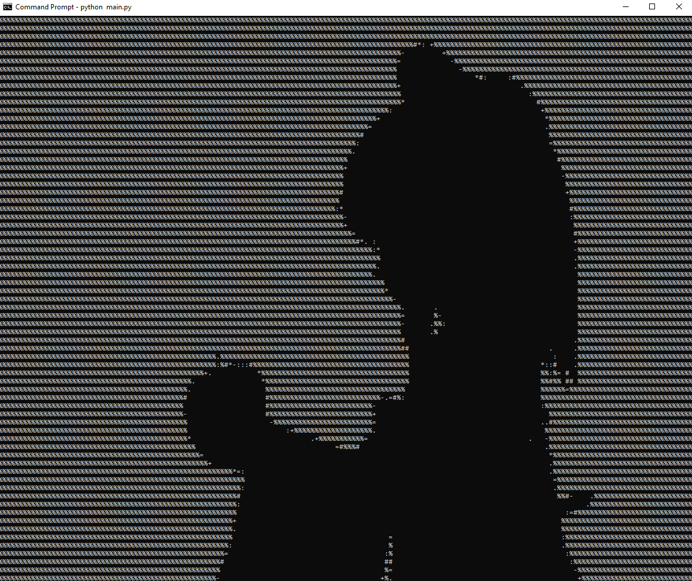

# ASCII-Animation-generator

A command-line script that plays any MP4 file as an ASCII animation within a command-line interface.

#### Disclaimer:
This project's example and inspiration are both taken from a trend on the internet of shocasing remakes of the animation of Bad Apple!! on a large variety of technologies (like in within a CLI).

## Why...
Why not?



## Installation

1. Clone the repository:
```bash
git clone https://github.com/complexape/ASCII-Animation-generator.git
```
2. Install all of the required packages:
```bash
pip install -r requirements.txt
```

3. Navigate to to your cloned repo in your file explorer, and drag any MP4 files into the `/videos` folder. (Videos will NOT be detected if they're outside of the `/videos` folder)

## Usage

1. Run the python file: 
```bash
python main.py
```

2. If you have multiple MP4 files inside of `/videos`, there will be list of all the files for you to choose.
```bash
1 - badapple.mp4
2 - video.mp4
3 - video2.mp4
respond with the number of the file you would like to play: 1
```
(Your chosen video's audio will get downloaded as a seperate MP3 file in the `/audio` folder.)
#### Tip: 
* Use **Ctrl-C** or **Command-C** (for Mac) to pause or end the animation!
```bash
Animation paused. Continue? (y)
```

## License